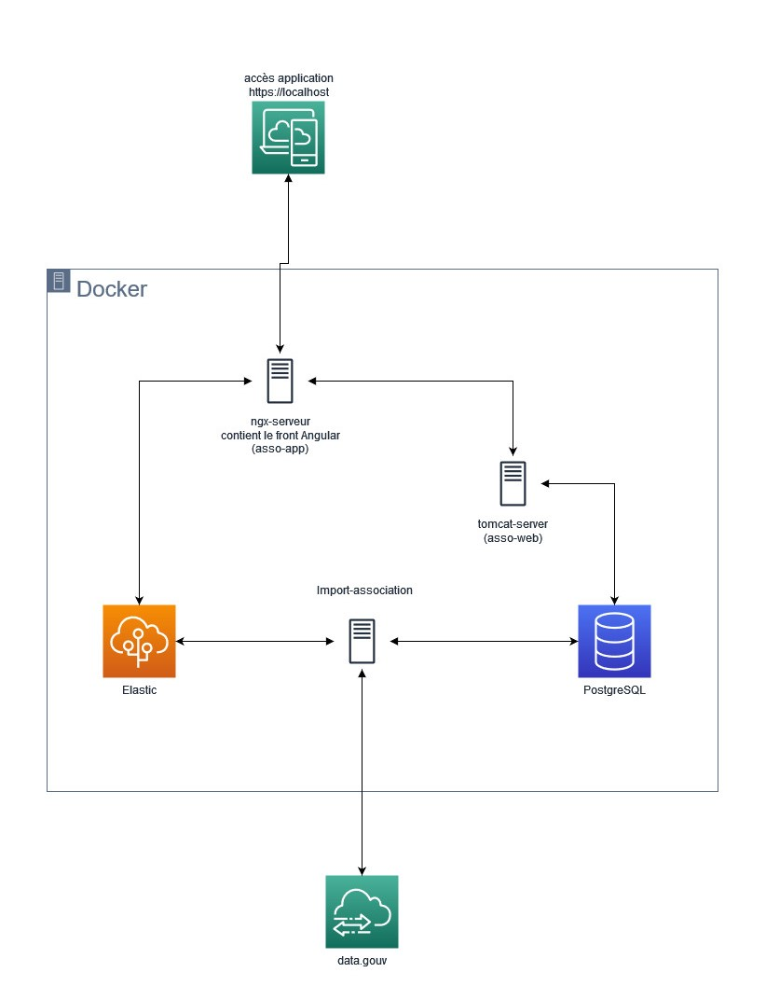
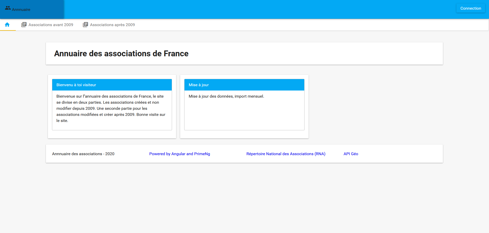

# Description :

Projet qui me permet de faire de la veille technologique, j'utilise en entrer la base de données des associations.
Le but étant de permettre la recherche des associations française et d'afficher la description d'une l'association. 

# Plateforme : 

Back : Spring boot 2, JAVA 17

Front : PrimeNg, Angular 13, cartographie leaflet

Base de données : PostgresSql 14

Indexer NoSql : ElasticSearch / Kibana 7.16 + Application d'indexation spring boot 2 Java 17. 

Api doc : http://localhost:8080/open/api/swagger-ui/index.html

# Installation de l'application

Cette application nécessite docker et la WSL pour être lancé dans un environnement windows.
https://nickjanetakis.com/blog/setting-up-docker-for-windows-and-wsl-to-work-flawlessly

Le fichier docker-compose à la racine du projet permet la compilation de la partie JAVA et Angular du projet.
Le répertoire "docker_asso" contient l'environnement d'exécution du projet, sous la forme d'une description dockeriser.

Lancement de l'installation de l'environement :

`$ cd docker_asso`

`$ bash -xe install.sh`

A la fin de l'installation, l'application est accessible via un navigateur `localhost`

Kibana est accessible via un navigateur `localhost:5601`

Connexion :  admin / Admintcg2018#

# IHM

